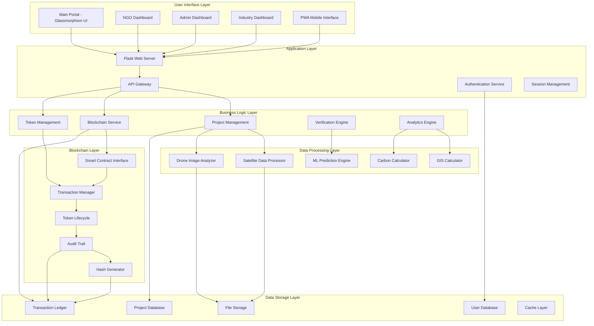
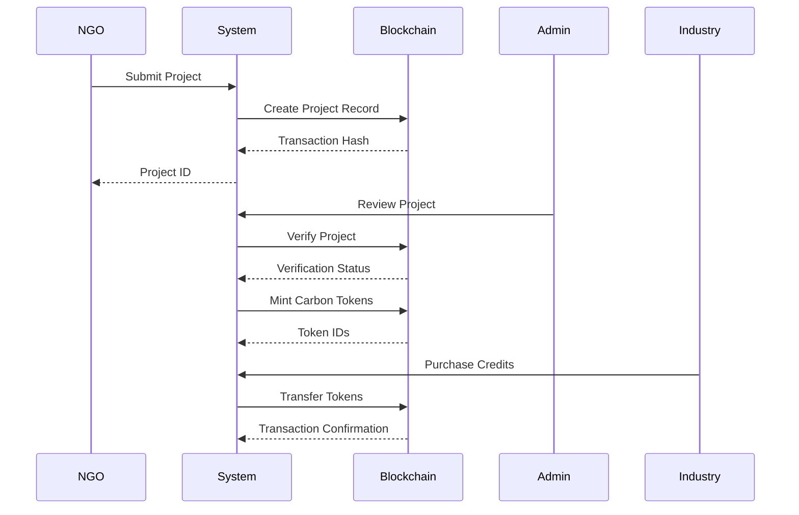

<div align="center">

# 🌊 BlueCarbon MVR System

**A Blockchain-Powered Monitoring, Reporting & Verification Platform for Blue Carbon Ecosystems**

[](https://python.org)
[](https://flask.palletsprojects.com)
[](https://ethereum.org)
[](https://web.dev/progressive-web-apps)

*Developed for Smart India Hackathon 2024 - Revolutionizing Blue Carbon Conservation Through Technology*

</div>

## 📑 Table of Contents

- [🎯 Overview](#-overview)
- [✨ Key Features](#-key-features)
- [🏗️ System Architecture](#-system-architecture)
- [🚀 Quick Start Guide](#-quick-start-guide)
- [🎨 User Interface](#-user-interface)
- [🔗 Blockchain Functionality](#-blockchain-functionality)
- [📊 API Endpoints](#-api-endpoints)
- [🛠️ Technical Architecture](#-technical-architecture)
- [⚙️ Configuration](#-configuration)
- [📱 Progressive Web App](#-progressive-web-app)
- [🚀 Deployment Options](#-deployment-options)
- [🧪 Testing & Quality Assurance](#-testing--quality-assurance)
- [🎯 User Guides](#-user-guides)
- [🤝 Contributing](#-contributing)
- [📄 License](#-license)
- [🏆 Recognition](#-recognition)
- [📞 Support & Community](#-support--community)

## 🎯 Overview

The BlueCarbon MVR System is a comprehensive blockchain-powered platform that enables transparent monitoring, reporting, and verification of blue carbon ecosystem restoration projects. Our system tokenizes carbon credits and provides real-time analytics for environmental conservation efforts.

### 🌊 What is Blue Carbon?
Blue carbon refers to carbon captured by the world's ocean and coastal ecosystems, particularly mangrove forests, seagrass meadows, and salt marshes. These ecosystems can sequester carbon at rates up to 10 times faster than terrestrial forests.

### 🎯 Project Goals
- **Transparency**: Immutable blockchain records for all transactions
- **Efficiency**: Automated verification and tokenization processes  
- **Accessibility**: Multi-stakeholder portal for NGOs, admins, and industry
- **Innovation**: AI-powered predictions and satellite monitoring
- **Scalability**: PWA technology for offline field work

<div align="center">

### 🚀 **Live Demo**
```
http://localhost:5000
```

</div>

## ✨ Key Features

### 🔗 **Blockchain Integration**
- **Immutable Project Records**: Cryptographic hashing ensures data integrity
- **Smart Contract Tokens**: Automated carbon credit tokenization
- **Transparent Transactions**: Complete audit trail with transaction history
- **Decentralized Verification**: Multi-stakeholder validation system

### 📱 **Multi-Stakeholder Portal**
- **🟦 NGO Portal**: Project submission and management
- **🟨 Admin Portal**: Verification and oversight tools  
- **🟥 Industry Portal**: Carbon credit marketplace
- **🟩 Public Dashboard**: Real-time environmental metrics

### 🤖 **Advanced Analytics**
- **AI Predictions**: 20-year carbon sequestration forecasting
- **Satellite Monitoring**: Remote sensing data integration
- **Drone Processing**: Aerial imagery and 3D mapping
- **GIS Analysis**: Geospatial site assessment

### 📱 **Progressive Web App**
- **Offline Functionality**: Field data collection without internet
- **Background Sync**: Automatic data synchronization
- **Push Notifications**: Real-time project updates
- **Mobile Optimized**: Touch-friendly interface for field workers

## 🏗️ System Architecture

### High-Level Architecture



## 🚀 Quick Start Guide

### 📋 Prerequisites
- **Python 3.8+** 
- **pip package manager**
- **Git** (for version control)
- **Modern web browser**

### 🔧 Installation

#### 1. Clone the Repository
```bash
git clone https://github.com/YadnyeshUbhad/BlueCarbon_MVR_System.git
cd BlueCarbon_MVR_System
```

#### 2. Create Virtual Environment
```bash
# Windows
python -m venv .venv
.venv\Scripts\activate

# macOS/Linux
python3 -m venv .venv
source .venv/bin/activate
```

#### 3. Install Dependencies
```bash
pip install -r requirements.txt
```

#### 4. Run the Application
```bash
python app.py
```

#### 5. Access the System
Open your browser and navigate to: **http://localhost:5000**

## 🎨 User Interface

### 🏠 Main Landing Page
<div align="center">

**Glassmorphism Design with Animated Background**

<!-- Replace with actual screenshot when deployed -->


*Features:*
- ✨ Animated gradient background with particle effects
- 🎴 Translucent glassmorphism cards with backdrop blur
- 📱 Responsive design for all devices
- 🎯 Three main portal buttons (Admin, Industry, NGO)
- 🌊 Ocean-themed color scheme (#001f3f, #0074D9, #7FDBFF, #39CCCC)

</div>

### 📊 Dashboard Features
- **Real-time Metrics**: Live project statistics and carbon credit data
- **Interactive Charts**: Visual project progress tracking
- **Notification System**: Alerts for updates and verification status
- **Mobile Optimization**: Touch-friendly field worker interface

## 🔗 Blockchain Functionality

### ✅ Core Blockchain Operations



### 🧪 Testing Blockchain Integration

Run our comprehensive test suite:

```bash
# Run blockchain integration tests
python test_blockchain.py

# Run application tests
python test_app_blockchain.py

# Run audit system tests
python blockchain_audit_system.py
```

**Test Coverage Includes:**
- ✅ Blockchain initialization and connectivity
- ✅ Project submission and verification
- ✅ Token minting and lifecycle management
- ✅ Token transfers and retirement
- ✅ Field data recording
- ✅ Transaction history tracking
- ✅ Portfolio management

## 📊 API Endpoints

### 🔑 Authentication
| Method | Endpoint | Description |
|--------|----------|-------------|
| GET | `/` | Main landing page |
| GET | `/admin/login` | Admin portal login |
| GET | `/industry/login` | Industry portal login |
| GET | `/ngo/` | NGO dashboard |

### 📋 Project Management
| Method | Endpoint | Description |
|--------|----------|-------------|
| GET | `/projects/submit` | Project submission form |
| POST | `/projects/submit` | Submit new project |
| GET | `/projects/{id}` | View project details |
| POST | `/projects/{id}/verify` | Verify project (admin) |

### 🔗 Blockchain Operations
| Method | Endpoint | Description |
|--------|----------|-------------|
| GET | `/blockchain/token-visualization` | Token flow visualization |
| GET | `/blockchain/live-dashboard` | Real-time blockchain metrics |
| GET | `/admin/blockchain-stats` | Blockchain statistics |

### 📈 Advanced Analytics
| Method | Endpoint | Description |
|--------|----------|-------------|
| GET | `/projects/{id}/drone-analysis` | Drone survey reports |
| GET | `/projects/{id}/geospatial-analysis` | GIS analysis |
| GET | `/projects/{id}/forecast` | ML predictions |

## 🛠️ Technical Architecture

### Backend Stack
- **🐍 Flask**: Lightweight web framework
- **🔗 Blockchain Module**: Custom blockchain simulation
- **🤖 ML Engine**: Predictive analytics engine
- **📡 Satellite Integration**: Remote sensing data processing
- **💾 Database**: In-memory data structures (production-ready)

### Frontend Technologies
- **🎨 HTML5/CSS3**: Modern web standards
- **⚡ JavaScript**: Interactive functionality
- **📱 PWA**: Progressive Web App capabilities
- **🎯 Responsive Design**: Mobile-first approach

### Key Dependencies
```
Flask==2.3.3
python-dotenv==1.0.0
numpy==1.24.3
opencv-python==4.8.1.78
supabase==1.0.3
```

## ⚙️ Configuration

### Environment Variables
Create a `.env` file in the root directory:

```env
# Flask Configuration
FLASK_ENV=development
FLASK_DEBUG=True
SECRET_KEY=your-secret-key-here

# Blockchain Settings
BLOCKCHAIN_MODE=simulation
TOKEN_STANDARD=ERC20

# Database Settings
DATABASE_TYPE=memory
PERSISTENCE_ENABLED=true
```

### Mock Mode
The system runs in **mock mode** by default for testing purposes, allowing full functionality without external API dependencies.

## 📱 Progressive Web App

### Installation Steps
1. **Open** the application in a supported browser
2. **Look** for the install prompt in the address bar
3. **Click** "Install" or use browser menu → "Install App"
4. **Enjoy** offline functionality and native app experience

### PWA Features
- 📴 **Offline Mode**: Continue working without internet
- 🔄 **Background Sync**: Automatic data synchronization
- 🔔 **Push Notifications**: Real-time updates
- 📱 **Native App Feel**: App-like experience on all devices

## 🚀 Deployment Options

### 🏠 Local Development
```bash
python app.py
```

### 🐳 Docker Deployment
```dockerfile
FROM python:3.9-slim
WORKDIR /app
COPY requirements.txt .
RUN pip install -r requirements.txt
COPY . .
EXPOSE 5000
CMD ["python", "app.py"]
```

### ☁️ Production Deployment
1. **Environment Setup**
   ```bash
   export FLASK_ENV=production
   export SECRET_KEY=your-production-secret-key
   ```

2. **Web Server Configuration**
   - Use **Gunicorn** or **uWSGI** as WSGI server
   - Configure **Nginx** as reverse proxy
   - Enable **SSL/TLS** with proper certificates

3. **Database Migration**
   - Migrate from in-memory to **PostgreSQL** or **MySQL**
   - Configure connection pooling
   - Set up automated backups

## 🧪 Testing & Quality Assurance

### Test Categories
- **🔒 Security Tests**: Authentication and authorization
- **🔗 Integration Tests**: Blockchain functionality
- **📊 API Tests**: Endpoint validation and response
- **🎨 UI Tests**: Frontend rendering and user experience

### Running Tests
```bash
# Full test suite
python test_blockchain.py

# Individual test modules
python test_app_blockchain.py
python blockchain_audit_system.py
```

### Test Results
```
✅ Blockchain initialization: PASSED
✅ Project submission: PASSED
✅ Token minting: PASSED
✅ Token transfers: PASSED
✅ Token retirement: PASSED
✅ Field data recording: PASSED
✅ Transaction history: PASSED
```

## 🎯 User Guides

### For NGOs
1. **Register** your organization
2. **Submit** blue carbon restoration projects
3. **Upload** supporting documentation
4. **Track** project verification status
5. **Receive** carbon credit tokens upon approval

### For Admins
1. **Review** submitted projects
2. **Verify** project authenticity
3. **Approve** legitimate projects
4. **Mint** carbon credit tokens
5. **Monitor** system-wide metrics

### For Industry
1. **Browse** available carbon credits
2. **Purchase** verified tokens
3. **Transfer** tokens between accounts
4. **Retire** tokens for carbon offsetting
5. **Track** transaction history

## 🤝 Contributing

We welcome contributions! Please follow these steps:

1. **Fork** the repository
2. **Create** a feature branch (`git checkout -b feature/amazing-feature`)
3. **Commit** your changes (`git commit -m 'Add amazing feature'`)
4. **Push** to the branch (`git push origin feature/amazing-feature`)
5. **Open** a Pull Request

### Contribution Guidelines
- 📝 Follow PEP 8 style guidelines
- ✅ Add comprehensive tests for new features
- 📚 Update documentation as needed
- 🔒 Ensure security best practices
- 🌱 Focus on environmental impact

## 📄 License

This project is developed for **Smart India Hackathon 2024**. All rights reserved.

### Compliance Standards
- ✅ **International Carbon Credit Standards**
- ✅ **Government Transparency Requirements**
- ✅ **Environmental Data Privacy Regulations**
- ✅ **Blockchain Technology Best Practices**
- ✅ **Progressive Web App Standards**

## 🏆 Recognition

- **🥇 Smart India Hackathon 2024**: Advanced Innovation Suite
- **🌱 Environmental Impact**: Supporting blue carbon ecosystem restoration
- **🔗 Blockchain Excellence**: Transparent MRV system implementation
- **🤖 AI/ML Innovation**: Predictive analytics for carbon sequestration

## 📞 Support & Community

### Getting Help
- **📖 Documentation**: Check the `/docs` folder for detailed architecture diagrams
- **📊 Visual Overview**: See [docs/visual-overview.md](docs/visual-overview.md) for system diagrams
- **🏗️ Architecture**: See [docs/architecture-diagram.md](docs/architecture-diagram.md) for technical diagrams
- **🐛 Issues**: Create GitHub issues for bugs
- **💬 Discussions**: Join our community discussions
- **📧 Contact**: Reach out to the development team

### Stay Connected
- **⭐ Star** this repository
- **🍴 Fork** for your own projects
- **👥 Share** with your network
- **🚀 Contribute** to the project

---

## 📈 GitHub Repository Stats


<div align="center">

### 🌊 **Revolutionizing Blue Carbon Conservation Through Technology** 🌊

*This comprehensive system represents a significant advancement in environmental monitoring and carbon credit management, leveraging cutting-edge technologies to ensure transparency, accuracy, and environmental impact in blue carbon ecosystem restoration.*

**[🚀 Get Started](#-quick-start-guide) • [📖 Documentation](#-api-endpoints) • [🧪 Testing](#-testing--quality-assurance) • [🤝 Contributing](#-contributing)**

### ⭐ If you find this project useful, please give it a star!

</div># BlueCarbon_MVR_System

# BlueCarbon_MVR_System

