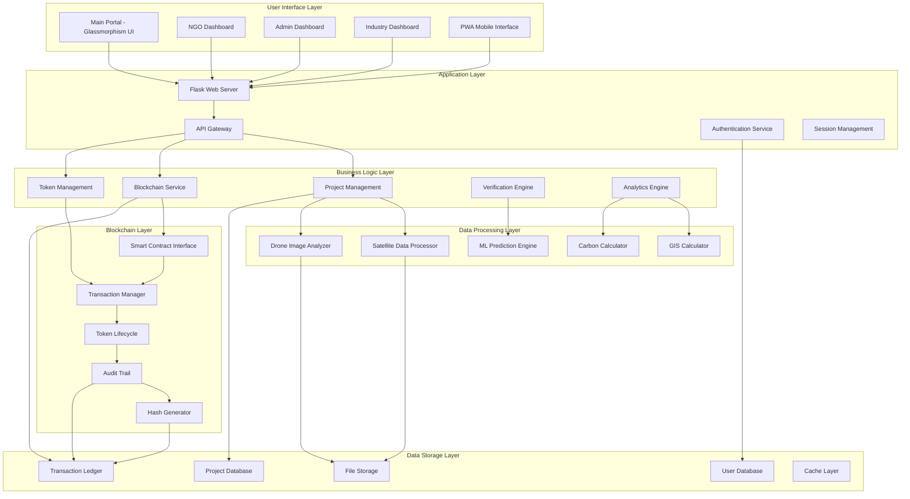
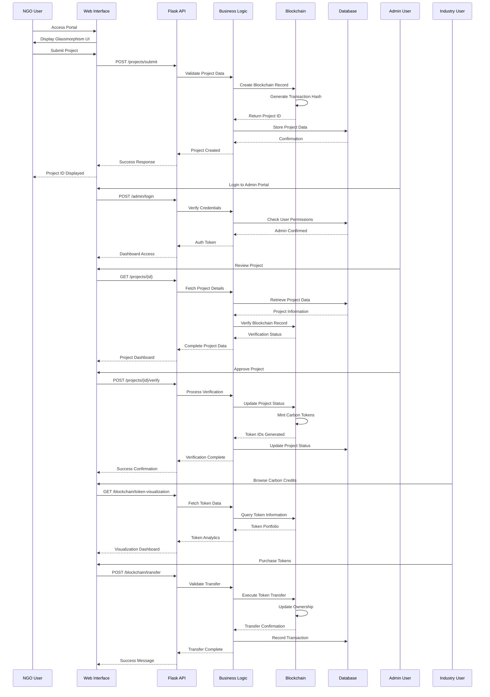
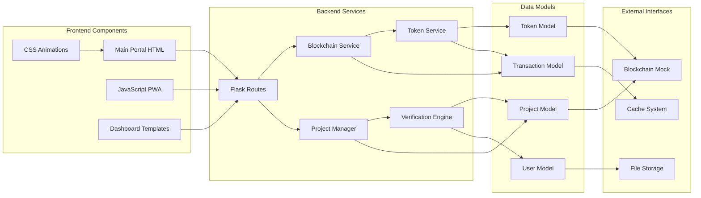
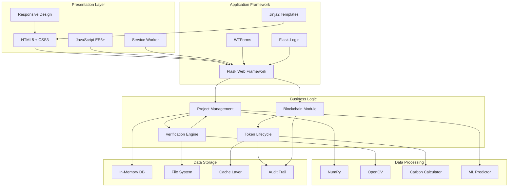
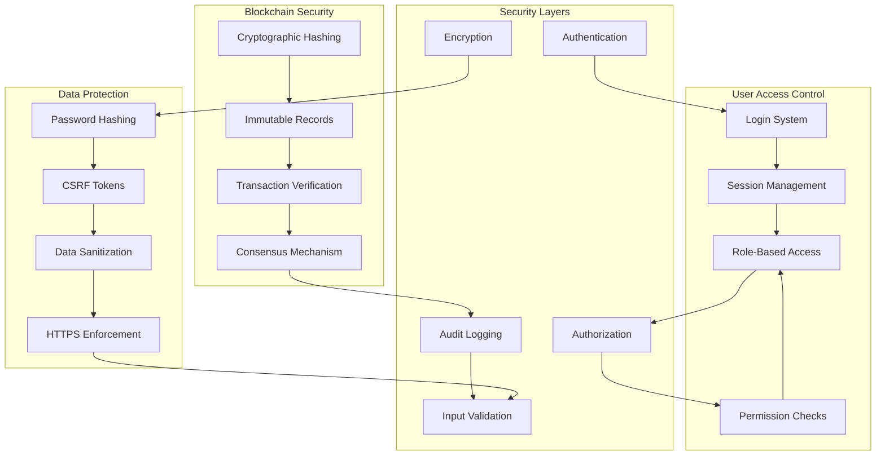

# BlueCarbon MVR System Architecture

## System Overview Diagram



## Data Flow Sequence



## Component Interaction Diagram



## Technology Stack Visualization



## Security Architecture



---

## How to Use These Diagrams

These Mermaid diagrams are designed to render automatically on GitHub. They provide:

1. **System Architecture**: Overall component relationships and data flow
2. **Sequence Diagrams**: Step-by-step process flows for key operations
3. **Component Interaction**: Detailed technical component relationships
4. **Technology Stack**: Visual representation of technologies used
5. **Security Architecture**: Security layers and protection mechanisms

To include these in your README.md, use the following format:

```markdown
## System Architecture

```mermaid
[Copy any diagram from above]
```
```